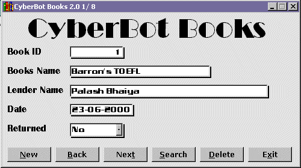



## CyberBot Books

### Description

You can save information about your books in it ! A nice example of database program.Included a kool sub-routine that creates shadow ! A Must Download ! ! !
 
### More Info
 
info

             |
---                |---
**Submitted On**   |2000-10-03 22:27:10
**By**             |[Md Emran Hasan](https://github.com/Planet-Source-Code/PSCIndex/blob/master/ByAuthor/md-emran-hasan.md)
**Level**          |Intermediate
**User Rating**    |4.7 (28 globes from 6 users)
**Compatibility**  |VB 3\.0, VB 4\.0 \(16\-bit\), VB 4\.0 \(32\-bit\), VB 5\.0, VB 6\.0
**Category**       |[Files/ File Controls/ Input/ Output](https://github.com/Planet-Source-Code/PSCIndex/blob/master/ByCategory/files-file-controls-input-output__1-3.md)
**World**          |[Visual Basic](https://github.com/Planet-Source-Code/PSCIndex/blob/master/ByWorld/visual-basic.md)
**Archive File**   |[CODE\_UPLOAD104131032000\.zip](https://github.com/Planet-Source-Code/md-emran-hasan-cyberbot-books__1-11884/archive/master.zip)

